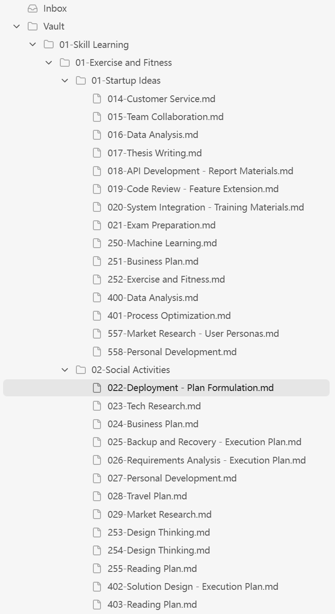
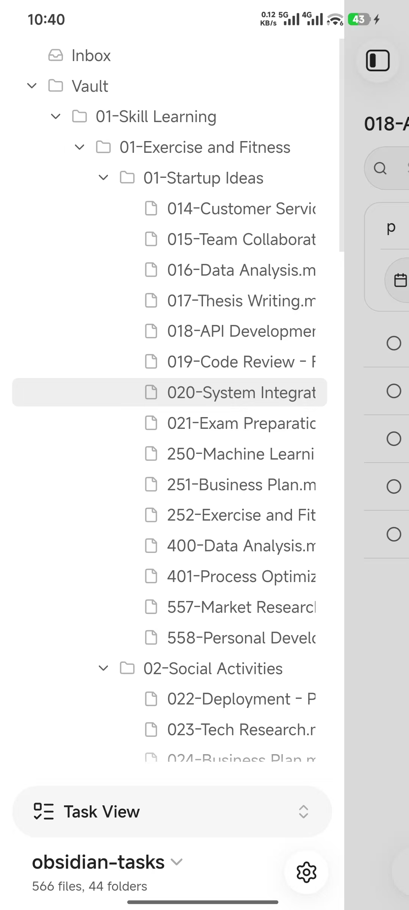
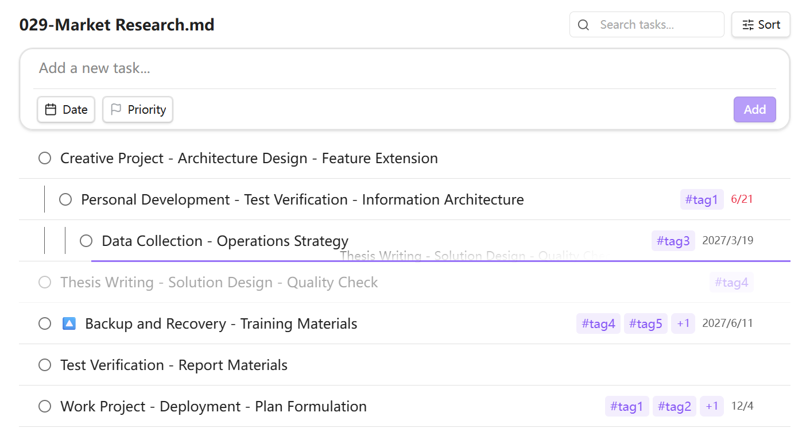
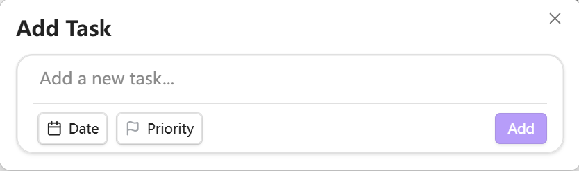

# Taskist

A task management tool that turns your Markdown notes into a powerful task system. 

## What Taskist Does

Taskist parses Markdown task lists (`- [ ]`) from your notes and turns them into a fully-featured task management system. Your tasks stay as plain text in your Markdown files — no proprietary formats, no lock-in. Edit them in Taskist's UI or directly in your notes; both stay in sync.

## Core Features

### Markdown-Native Tasks
- Tasks are stored as standard Markdown (`- [ ] Task title`)
- Full round-trip parsing: edit in the UI or in your notes
- File-level `taskist-ignore` support to exclude files from task indexing
- Hierarchical tasks with parent-child relationships

### Task Navigator (Side Panel, command palette *Taskist: Open task navigator view*)
A tree view for quick navigation:
- **Inbox**: a dedicated catch-all file for quick task capture
- **Vault tree**: browse tasks by your folder structure
- **Tag tree**: hierarchical tag browser with nested tag support

### Task List View
A dedicated task panel with powerful organization:
- **Multi-source browsing**: view tasks by file, by tag, or from your Inbox
- **Grouping**: group tasks by status, priority, tags, due date, or heading
- **Sorting & filtering**: sort by priority or due date; filter by priority, tags, or keyword search
- **Drag-and-drop reordering**: reorder tasks within a file, or drag between groups to update properties automatically
- **Inline editing**: click any task to edit its title, priority, due date, and tags inline
- **Subtasks**: add child tasks under any task with proper indentation
- **Virtual scrolling**: handles thousands of tasks smoothly

### Task Editor
- Type `!` to set task priority
- Natural language due date parsing (e.g., "next Friday")
- Type `#` to add tags
- Type `~` to choose save location

### Quick Add Modal
Capture tasks instantly via command palette:

### Real-Time Sync
- Tasks update instantly when you edit Markdown files
- Handles file renames, moves, and deletions automatically
- Persists task cache across sessions for fast startup

### I18n Support
Multi-language support for English and Chinese
